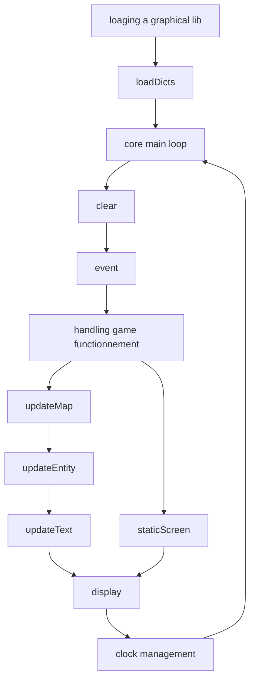
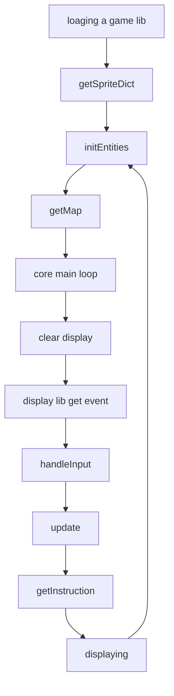

# Interfaces pour le projet Arcade

**Table des matières**
- 1 - [Comment l'utiliser sur votre propre repository ?](#1---comment-lutiliser-sur-votre-propre-repository-)
  - [Importer ArcadeInterface en tant que sous-module](#importer-arcadeinterface-en-tant-que-sous-module)
    - [Créer le sous-module](#créer-le-sous-module)
    - [Comment corriger l'adresse de mon sous-module ?](#comment-corriger-ladresse-de-mon-sous-module-)
    - [Importer les fichiers du sous-module](#importer-les-fichiers-du-sous-module)
  - [Mettez à jour régulièrement le sous-module](#mettez-à-jour-régulièrement-le-sous-module)
  - [Modifier le sous-module que vous avez importer dans votre repository](#modifier-le-sous-module-que-vous-avez-importer-dans-votre-repository)
- 2 - [Interface de pour librairie graphique](#2---interface-pour-librairie-graphique)
- 3 - [Interface de pour librairie de jeu](#3---interface-de-pour-librairie-de-jeu)
- 4 - [Théorie complémentaire vis-à-vis du fonctionnement](#4---théorie-complémentaire-vis-à-vis-du-fonctionnement)
- 5 - [Kiwi is love, kiwi is life](#5---kiwi-is-love-kiwi-is-life)

## 1 - Comment l'utiliser sur votre propre repository ?

Vous pouvez importer ce repository en tant que sous-module de votre propre repository. Pour cela, suivez le court tutoriel qui suit.

### Importer ArcadeInterface en tant que sous-module

> Sauf précision de notre part, veuillez exécuter les commandes depuis la racine de votre repository.

Pour importer un sous-module sur votre repository vous devez utiliser la suite de commande `git submodule`.

#### Créer le sous-module

Premièrement il faut ajouter le module à votre projet.

```
git submodule add git@github.com:ASM-Studios/ArcadeInterfaces.git
```

> **N'utilisez pas l'adresse http du projet pour créer votre module !**

Vous pouvez vérifier que la commande s'est correctement exécutée avec un `git status`. En effectuant `git status` vous devriez obtenir un output semblable au suivant :

```
Sur la branche main
Votre branche est à jour avec 'origin/main'.

Modifications qui seront validées :
  (utilisez "git restore --staged <fichier>..." pour désindexer)
	nouveau fichier : .gitmodules
	nouveau fichier : ArcadeInterfaces

```

L'information importante à remarquer est la création du fichier `.gitmodules` et du dossier `ArcadeInterfaces`. Le fichier `.gitmodules` est le fichier de configuration des sous-modules de votre repository. Le dossier `ArcadeInterfaces` est celui qui contiendra tout le code de notre sous-module.

#### Comment corriger l'adresse de mon sous-module ?

> Si vous n'avez pas encore rencontré de problèmes, passez cette étape.

Si vous avez renseigné une mauvaise adresse pour un sous-module, notamment si vous avez utilisé une adresse http au lieu d'une adresse ssh, vous avez deux solutions :

- soit vous recommencez à zéro en supprimant les fichiers et dossiers créés par `git submodule add`
- soit vous modifiez la configuration du fichier `.gitmodules`

Voyons comment effectuer la deuxième option.

Commencez par ouvrir le fichier `.gitmodules`. Vous devriez voir quelque chose de similaire à ça :

```
[submodule "ArcadeInterfaces"]
	path = ArcadeInterfaces
	url = git@github.com:ASM-Studios/ArcadeInterfaces.git
```

Ce que vous voyez est la déclaration du sous-module ArcadeInterfaces.
- La variable `path` correspond au chemin jusqu'au dossier qui contient le sous-module à partir de la racine de votre repository. Vous pouvez donc déplacer et renommer le dossier ArcadeInterfaces du moment que vous mettez à jour le `path` du `.gitmodules`.
- La variable `url` correspond à l'url utilisée pour cloner le repository du sous-module. Pour importer notre sous-module vous devez mettre `git@github.com:ASM-Studios/ArcadeInterfaces.git` comme url.

Une fois que vous avez effectué vos modifications sur `.gitmodules` vous devez synchroniser vos sous-modules sur la nouvelle configurations. Pour cela utilisez la commande suivante :

```
git submodule sync --recursive
```

Normalement à ce stade là votre sous-module est près pour continuer le tutoriel.

#### Importer les fichiers du sous-module

Normalement à ce stade du tutoriel, le dossier du sous-module sur votre repository est vide.
Pour importer les fichiers vous devez initialiser le sous-module avec la commande suivante :

```
git submodule init ./ArcadeInterfaces/
```

Normalement à ce stade là le dossier du sous-module ressemble à ce qu'aurait donné un "git clone" de son repository.

### Mettez à jour régulièrement le sous-module

Le sous-module du ArcadeInterfaces que vous avez créé sur votre repository fonctionne comme un repository. Cela implique que la gestion des fichiers est asynchrone aussi.

Sur un repository classique il suffit d'effectuer la commande "git pull" pour récupérer les dernières modifications en local sur votre machine.

Pour un sous-module c'est un poil plus subtil. Vous devez d'abord récupérer les dernières modifications en local du sous-module. Et ensuite vous devez commit ces modifications pour mettre à jour la version du sous-module de votre projet sur GitHub.

Pour cela vous devez d'abord effectuer la commande suivante :

```
git submodule update --remote
```

Cette commande récupère les dernières modifications d'un sous-module un peu comme un "git pull".

Ensuite vous envoyez ces modifications sur le votre repository :

```
git add .gitmodules ArcadeInterface/
git commit -m "[FIX] mise à jour du sous-module ArcadeInterfaces"
git push
```

Si tout s'est bien passé vous devriez obtenir une sortie similaire avec un `git status` :

```
Sur la branche main
Votre branche est à jour avec 'origin/main'.

rien à valider, la copie de travail est propre
```

Si vous n'avez pas réussi à effectuer l'une des commandes précédentes :
- vérifiez qu'il n'y a pas un conflit sur la branche sur laquelle vous travaillez
- vérifiez si la configuration de l'adresse du module est conforme

### Modifier le sous-module que vous avez importer dans votre repository

> Avant tout, vérifier avec le propriétaire du repository du module ArcadeInterfaces que vous avez le droit d'éditer le projet.

Comme mentionné précédemment, un sous-module ressemble fortement à un repository. Vous pouvez en réalité utiliser toutes les fonctionnalités d'un repository classique à l'intérieur d'un sous-module.

Donc pour commit une modification locale de votre sous-module sur le repository de ArcadeInterfaces il vous suffit de vous déplacer à la racine du sous-module avec `cd` puis d'effectuer les commandes classiques du genre :

```
git add *
git commit -m "description du commit"
git push
```

Une fois que vous avez effectué votre commit dans ArcadeInterfaces, revenez à la racine de votre repository est faites un commit pour sauvegarder ces modification sur votre projet aussi.

## 2 - Interface pour librairie graphique

Cette section explique le fonctionnement commun prévu pour les librairies graphiques ainsi que leur interface.

### Fonctions externalisées

L'architecture prévoie deux fonctions à externaliser pour être utiliser dans le "core".

```cpp
IDisplayModule *entryPoint();
Signature getSignature();
```

- La fonction `entryPoint` renvoie une instance de la classe dérivée de `IDisplayModule`.
- La fonction `getSignature` renvoie une `Signature` qui permet d'identifier la lib comme conforme à une librairie graphique du projet.

Une `Signature` est définie de la manière suivante :

```cpp
enum Signature {
    GAME = 404,
    GRAPHICAL = 808
};
```

La fonction `getSignature` d'une librairie graphique est sensée retourner `GRAPHICAL`.

### Description de l'interface

Le boulot de la librairie graphique c'est d'afficher le jeu à l'écran.

#### Préparer la librairie pour l'affichage

Pour initier une librairie il faut d'abord lui transmettre la liste des sprites à afficher. Pour cela il faut utiliser la méthode suivante :

```cpp
virtual void loadDicts(
    const std::map<EntityType, std::string>& spriteDict,
    const std::map<StaticScreen, std::string>& splashDict) = 0;
```

La fonction prend en argument:

- `std::map` d'`EntityType` et de `std::string`. L'`EntityType` est définie dans [Type.hhp](Type.hpp).

Ainsi il y a une entrée dans la `std::map` pour chaque valeur de `EntityType`. La `std::string` correspond au chemin vers le sprite correspondant au `EntityType`.

- `std::map` de `StaticScreen` et de `std::string`. `StaticScreen` est une `enum` définie dans [Type.hpp](Type.hpp).


#### Transmettre l'information à afficher

L'interface dispose de trois méthodes pour transmettre les informations à afficher.

```cpp
virtual void updateEntity(IEntity &entity) = 0;
virtual void updateMap(Map &map) = 0;
virtual void updateText(const std::string& text, Vector2D pos, bool highlight) = 0;
```

- La méthode `updateEntity` permet d'afficher sprite sous la forme d'une `IEntity`. `IEntity` est une classe définie dans [Type.hhp](Type.hpp) qui contient le type et la position d'un sprite à afficher.

```cpp
class IEntity {
    private:
        EntityType entityType;
        Vector2D position;
        bool visibility;

    public:
        virtual ~IEntity() = 0;
        virtual EntityType getEntityType() = 0;
        virtual void setEntityType(EntityType) = 0;
        virtual Vector2D getPosition() = 0;
        virtual void setPosition(Vector2D position) = 0;
        virtual bool getVisibility() = 0;
        virtual void setVisibility(bool visibility) = 0;
};
```

Les noms des variables sont équivoques. Précision tout de même que `Vector2D` représente une position dans un espace à deux dimension définie de la manière suivante :

```cpp
struct Vector2D {
    int x;
    int y;
};
```

En sachant que les opérateurs "+", "+=", "-" et "-=" sont surchargés pour `Vector2D`.

- La méthode `updateMap` permet d'afficher un tableau d'entité. Elle prend en argument une `Map`. Une `Map` est un alias défini dans [Type.hhp](Type.hpp).

```cpp
using Map = std::vector<std::vector<EntityType>>;
```

- La méthode `updateText` permet d'afficher une `std::string`. La méthode prend en argument le texte au format `std::string`, la position en `Vector2D` et un `bool`. Ce `bool` indique si le texte doit être surligné ou non. Si le texte doit être surligné, la couleur du texte et la couleur de son fond sont échangées.

L'interface possède aussi une méthode `staticScreen` pour afficher un écran fixe au besoin.

```cpp
virtual void staticScreen(StaticScreen screen) = 0;
```

La méthode prend en argument un `StaticScreen` qui est une `enum` qui permet de choisir le type d'écran à afficher. `StaticScreen` est défini dans [Type.hhp](Type.hpp).

```cpp
enum StaticScreen {
    SCREEN_SPLASH,
    SCREEN_GAMEOVER
};
```

#### Fonctions d'affichage classique

L'interface confère deux fonctions pour gérer le rafraîchissement de l'affichage.

```cpp
virtual void display() = 0;
virtual void clear() = 0;
```

- La méthode `display` permet d'afficher à l'écran toutes les informations préalablement données.

- La méthode `clear` permet d'effacer l'écran en cours.

#### Gestion des évènements

La librairie graphique est aussi chargée de gérer les évènements de l'utilisateurs. Pour cela, il faut utiliser la méthode `event`.

```cpp
virtual std::vector<Input> event() = 0;
```

La méthode renvoie un `std::vector` d'évènements sous la forme d'`Input`. Un `Input` est une `enum` qui indique le type d'évènement reçu.

```cpp
enum Input {
    UP,
    DOWN,
    LEFT,
    RIGHT,
    QUIT,
    MENU,
    ACTION
};
```

### Usage prévu de l'interface de librairie graphique

Le schéma ci-dessous représente l'algorithme prévu pour l'usage de la librairie graphique dans le "core".



## 3 - Interface pour librairie de jeu



## 4 - Théorie complémentaire vis-à-vis du fonctionnement

## 5 - Kiwi is love, kiwi is life

Merci d'avoir lue cette documentation jusqu'au bout. Kiwi est fier de vous.

<div style="text-align: center;">
    
</div>
